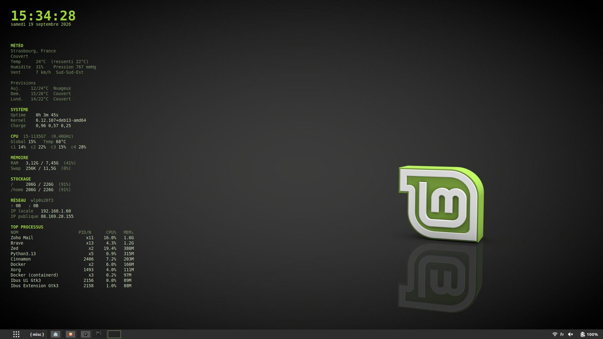

# conf

mes configurations personnelles

---

## conky

Thème Conky GitHub Dark / Linux Mint affiché en haut à gauche du bureau : horloge, météo (via `weather.py`), uptime, kernel, charge CPU, température, RAM et swap. Palette verte Mint, fond entièrement transparent, largeur fixe 420 px. Sur Cinnamon/Muffin, `start-conky.sh` pose un _strut_ de 448 px pour que les fenêtres maximisées ne recouvrent jamais le panneau.



1. Copier les fichiers dans `~/.config/conky/` :

   ```bash
   cp conky/conky.conf conky/start-conky.sh conky/weather.py conky/top_procs.py ~/.config/conky/
   chmod +x ~/.config/conky/start-conky.sh
   ```

2. Lancer manuellement :

   ```bash
   ~/.config/conky/start-conky.sh
   ```

1. Ajouter `~/.config/conky/start-conky.sh` aux applications au démarrage de Cinnamon pour le lancer automatiquement à la session.

---

## kernel

Noyau Debian recompilé « perso » (HZ=1000, `-march=tigerlake`) pour un meilleur ressenti desktop, en plus des réglages runtime (`preempt=full`, `transparent_hugepage=madvise` dans `/etc/default/grub`, et `power-profiles-daemon` en profil `performance`).

Le script `kernel/rebuild-kernel.sh` permet de reconstruire le noyau perso à partir des sources Debian patchées à chaque nouvelle version (`linux-source-6.12`), sans le paquet `-dbg` (inutile et énorme).

1. Installer les dépendances de compilation (une fois) :

   ```bash
   sudo apt update
   sudo apt install -y linux-source-6.12 build-essential libncurses-dev bison flex libssl-dev libelf-dev dwarves bc rsync kmod cpio fakeroot
   ```

2. Copier le script dans `~/kernel-build/` et lancer la compilation (aucun droit root requis à cette étape) :

   ```bash
   cp kernel/rebuild-kernel.sh ~/kernel-build/rebuild-kernel.sh
   ~/kernel-build/rebuild-kernel.sh
   ```

3. Installer les paquets générés (`sudo` requis, régénère automatiquement l'initramfs et GRUB) :

   ```bash
   sudo dpkg -i ~/kernel-build/linux-headers-*-perso_*.deb ~/kernel-build/linux-image-*-perso_*.deb
   ```

4. Redémarrer et sélectionner l'entrée `-perso` dans les options avancées de GRUB si elle n'est pas choisie par défaut.

Le noyau Debian stock reste toujours installé en parallèle comme filet de sécurité (mises à jour de sécurité automatiques via `unattended-upgrades`), donc il n'y a pas d'urgence à recompiler dès qu'une nouvelle version sort — le faire quand `apt list --upgradable` montre un nouveau `linux-image-*-amd64` suffit.
